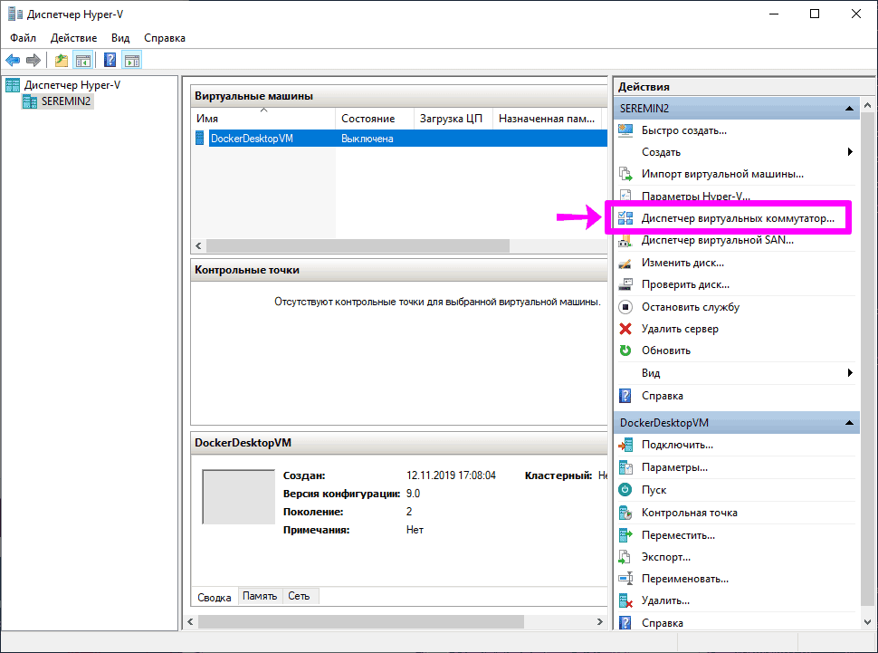
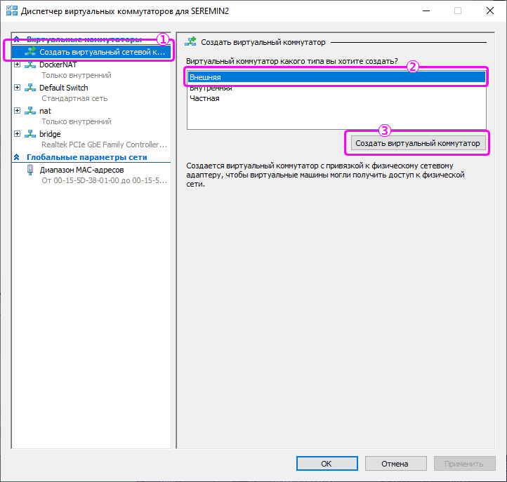

# docker

Задание (проект) docker (42 association / 21 school).

Предварительно нужно устновить `docker` и  `docker-machine`.

Для MacOS используем `brew`:

```bash
brew install docker docker-machine
```

Для Debian/Ubuntu:

```bash
sudo apt-get install docker docker-machine virtualbox
```

Для Windows:

Сначала установить Docker Desktop [скачав его с DokerHub](https://hub.docker.com/) (предварительно необходимо зарегистрироваться). Затем, в «Диспечере Hyper-V» (Hyper-V Manager) создать виртуальный коммутатор в режиме моста.

Открываем «Диспечер Hyper-V» и выбераем в нем «Диспетчер виртуальных комутатор...» (Virtual Switch Manager):



Выбираем пункт «Создать виртуальный сетевой коммутатор» (New virtula network switch), указываем его тип как «Внешний» (External network) и после нажимаем кнопку «Создать виртуальный коммутатор» (Create virtual switch):



Указываем имя для коммутатора (дальше мы будем его использовать при создании и конфигурировании Dockers-контейнеров) -- bridge. Указываем через какой сетевой адаптер будет работать сетевой мост нашего виртуального коммутатора. И подтверждаем создание коммутатора. 


Подождать, пока все настроится. 